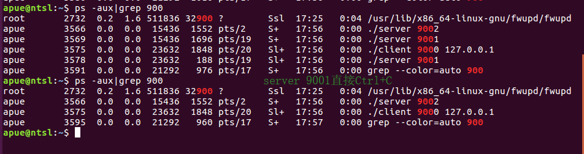
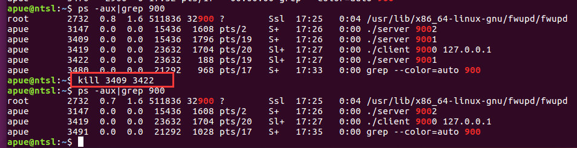

## Linux网络编程

* 描述

  某企业自己运营某Web应用，服务器采用Linux系统。平时主要由A服务器提供业务服务，当A服务器发生业务故障时，自动切换到B服务器提供业务服务，并且将A服务器当前还未执行完的程序同步到B服务器继续执行（假定A服务器发生业务故障时，网络功能不受影响，仍可以获取当前执行信息）。

## 思想

----------

client(客户端)通过adaptor(分配器)向server(服务器)发送请求，server发生异常终止后，adaptor检查到超时将任务转发给新的服务器。

## 运行命令

-----------------

1. Client、Adaptor、Server对应目录内make编译

2. 运行Server

   ```shell
   #Terminal 1
   ./server 9001
   #Teiminal 2
   ./server 9002
   ```

   

3. 运行Adaptor

   ```shell
   ##服务器信息必须保存在Adaptor目录下的config.txt文件中，可自行定义，格式如下：
       127.0.0.1,9001
       127.0.0.1,9002
   ##adaptor监听端口9000
   ./adaptor
   ```

   

4. 运行Client

   ```shell
   #客户端运行需要给定Adaptor 端口 ip
   ./client 9000 127.0.0.1
   ```

   

5. 数据请求为客户端输入两整数

6. 异常终止Server使用kill命令

## 记录

------

* 请求转发给新的服务器后，adaptor不再输出执行信息（2019.12.23记）

* 运行正常，只是貌似跟换服务器等待超时有点长（2019.12.24记）

  1. client、adaptor、server均支持多进程，多线程运行

  2. 直接在终端Ctrl+C不能直接完全杀死对应端口所有进程（存疑，server 9001执行Ctrl+C后进程也没了）

     

  3. 通过ps -aux查看进程，kill所有server 9001进程，adaptor正常运行

     